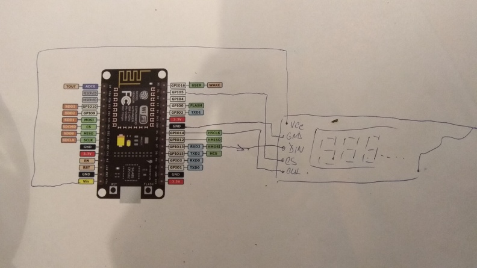

# Cryptoticker-by-dread-cz
Cryptoticker for your table

## What does it do?
Ticker shows the price(s) of chosen cryptocurrencies on Bitfinex. It connects to the Bitfinex websocket API using WiFi to get the data.

## How to make my own?
1. You will need:
* ESP8266 nodemcu board (or simmilar)
* pair of 8-digit LED displays driven by MAX7219
* Arduino with ESP8266 support installed
* my MAX7219 HW SPI library - [https://github.com/BugerDread/esp8266-hw-spi-max7219-7seg](https://github.com/BugerDread/esp8266-hw-spi-max7219-7seg)
* ArduinoJson library (by Benoit Blanchon) - install from Arduino Library Manager
* WebSockets library (by Markus Sattler) - also from lib manager
* WiFiManager library (by tzapu) - again lib mngr
* clone of [this repo](https://github.com/BugerDread/cryptoticker-by-dread-cz)
2. Hook up the 1st display to the ESP as on schematic below.
3. Hook up the 2nd display to the output of the 1st one.
4. Hook up the ESP to the computer, launch Arduino, open the ticker-ws-ticker.ino and upload it to the board.
5. Wait until the display reads "config 192.168.4.1" (it may take about 15seconds).
6. Connect to the "Bgr ticker" WiFi network (via phone or computer - password is "btcbtcbtc") and open http://192.168.4.1 in your web browser it if doesnt do so automatically.
7. Click "Configure WiFi", then fill in (you can also click / tap it in the list above the form) name (SSID) and password for your WiFi (leave password blank for open WiFi).
8. Fill in list of bitfinex symbols separated by spaces, only trading pairs are supported - [list of symbols](https://api-pub.bitfinex.com/v2/conf/pub:list:pair:exchange).
9. You can also change brightness of the display (range 1-16) and interval how long is each value shown on the display.
10. Click save, wait few seconds, display should show "WiFi online" and then the ticker should start to show the prices of configured symbols. If it doesnt, please try to repeat the configuration and make sure that the configuration is correct.
11. If you want to configure the ticker again hold the "Flash" button on the nodemcu board for about 5 seconds to switch into configuration mode and repeat the steps above from #5.

## What if I cant follow steps above but still want to have the ticker?
Try to contact me using xgeorge@seznam.cz, if I have some spare time I can make one ticker for you :-)
